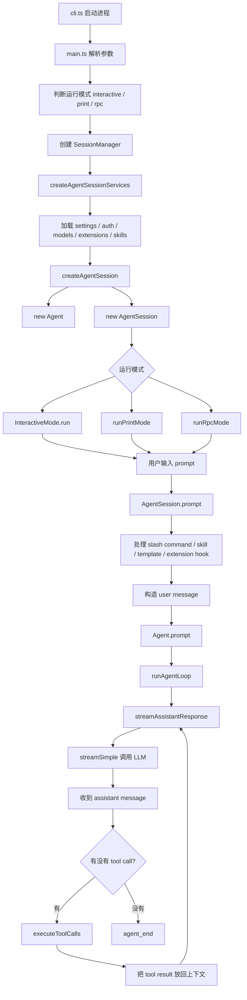
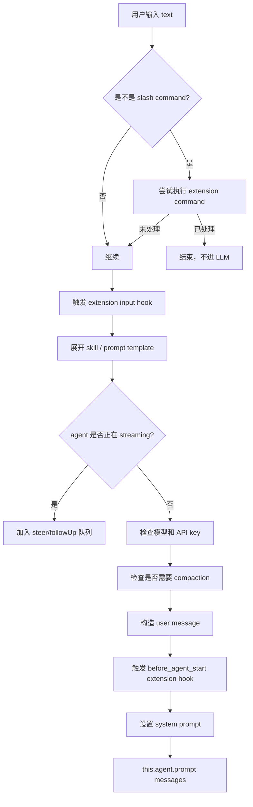

# Coding agent 项目学习指南

## User

我想学习这个 coding agent 项目，该如何开始呢？

## Assistant

我先快速看一下仓库的入口文档和包结构，再给你一条适合从零理解这个 coding agent 项目的学习路线。


{"targetDirectory":"c:\\projects\\pi","globPattern":"package.json"}
```


{"targetDirectory":"c:\\projects\\pi","globPattern":"packages/*/package.json"}
```


{"targetDirectory":"c:\\projects\\pi","globPattern":"README.md"}
```


{"path":"c:\\projects\\pi\\README.md","limit":160}
```


{"path":"c:\\projects\\pi\\package.json","limit":160}
```

## Assistant

这个仓库是一个 monorepo，核心分层已经很清楚：`coding-agent` 是 CLI 产品层，下面依赖 `agent` 运行时和 `ai` 模型适配层。我再看一下 coding-agent 自己的 README 和目录，确定推荐阅读顺序。


{"path":"c:\\projects\\pi\\packages\\coding-agent\\README.md","limit":220}
```


{"path":"c:\\projects\\pi\\packages\\coding-agent\\package.json","limit":180}
```


{"targetDirectory":"c:\\projects\\pi","globPattern":"packages/coding-agent/src/**"}
```


{"targetDirectory":"c:\\projects\\pi","globPattern":"packages/agent/src/**"}
```


{"targetDirectory":"c:\\projects\\pi","globPattern":"packages/ai/src/**"}
```

## Assistant

`coding-agent` 里主要有三条线：CLI/交互 UI、会话运行时、工具与扩展系统。最后我看几个入口文件，给你标出“先读哪些文件、读到什么程度”。


{"path":"c:\\projects\\pi\\packages\\coding-agent\\src\\cli.ts","limit":220}
```


{"path":"c:\\projects\\pi\\packages\\coding-agent\\src\\core\\agent-session-runtime.ts","limit":220}
```


{"path":"c:\\projects\\pi\\packages\\agent\\src\\agent-loop.ts","limit":220}
```


{"path":"c:\\projects\\pi\\packages\\agent\\src\\agent.ts","limit":180}
```


{"path":"c:\\projects\\pi\\packages\\coding-agent\\src\\core\\tools\\index.ts","limit":180}
```

## Assistant

建议按“从外到内”的顺序学，不要一开始钻进 TUI 组件。

1. 先读产品层说明  
   从 `README.md` 和 `packages/coding-agent/README.md` 开始，理解 Pi 是什么、支持哪些模式：interactive、print/JSON、RPC、SDK、extensions、skills。

2. 理清 monorepo 分层  
   这个项目主要是：
   - `packages/coding-agent`：CLI 产品层，命令、会话、工具、扩展、交互 UI。
   - `packages/agent`：核心 agent runtime，负责消息循环、工具调用、状态管理。
   - `packages/ai`：LLM provider 抽象，Anthropic/OpenAI/Gemini 等都在这里。
   - `packages/tui`：终端 UI 渲染库。
   - `packages/web-ui`：Web 聊天组件。

3. 先跟一条主执行链  
   推荐阅读顺序：
   - `packages/coding-agent/src/cli.ts`：CLI 入口。
   - `packages/coding-agent/src/main.ts`：启动逻辑。
   - `packages/coding-agent/src/core/agent-session.ts`：coding-agent 的会话封装。
   - `packages/agent/src/agent.ts`：状态化 Agent。
   - `packages/agent/src/agent-loop.ts`：核心循环，模型响应、工具调用、下一轮消息都在这里。
   - `packages/coding-agent/src/core/tools/index.ts`：内置工具入口。

4. 再分主题深入  
   - 想懂工具系统：读 `packages/coding-agent/src/core/tools/read.ts`、`edit.ts`、`bash.ts`、`write.ts`。
   - 想懂模型接入：读 `packages/ai/src/types.ts`、`stream.ts`、`api-registry.ts`、`providers/anthropic.ts`。
   - 想懂交互界面：读 `packages/coding-agent/src/modes/interactive/interactive-mode.ts` 和 `components/`。
   - 想懂扩展机制：读 `packages/coding-agent/src/core/extensions/` 和 `packages/coding-agent/examples/extensions/README.md`。
   - 想懂测试：从 `packages/coding-agent/test/suite/README.md` 开始。

5. 最好的练习任务  
   先做一个很小的改动，比如“给某个 slash command 加一条日志/提示”或“给 read 工具补一个边界测试”。这样能自然串起 CLI、session、tool、test。

如果你愿意，我可以下一步带你按“入口调用链”逐文件导读这个项目。

## User

在不借助已有 脚本的基础上，如何在本地启动 pi，我想通过 debug 的方式看流程

## Assistant

我先确认一下这个包的 TypeScript 入口和运行依赖，这样给你的启动方式可以避开仓库现成脚本，同时适合断点调试。


{}
```


{"path":"c:\\projects\\pi\\packages\\coding-agent\\tsconfig.build.json","limit":160}
```


{"path":"c:\\projects\\pi\\packages\\coding-agent\\src\\main.ts","limit":220}
```


{"path":"c:\\projects\\pi\\packages\\coding-agent\\src\\cli.ts","limit":80}
```


{"path":"c:\\projects\\pi\\packages\\agent\\package.json","limit":120}
```


{"path":"c:\\projects\\pi\\packages\\ai\\package.json","limit":120}
```

## Assistant

这里的一个关键点是：`coding-agent` 入口可以用 TS 直接跑，但它通过包名导入 `@earendil-works/pi-ai`、`pi-agent-core`、`pi-tui`，这些 workspace 包默认解析到各自的 `dist`。所以本地调试前需要先让依赖包有构建产物。


{"path":"c:\\projects\\pi\\tsconfig.base.json","limit":180}
```


{"path":"c:\\projects\\pi\\packages\\tui\\package.json","limit":120}
```


{"path":"c:\\projects\\pi\\packages\\coding-agent\\src\\cli\\args.ts","limit":220}
```


{"path":"c:\\projects\\pi\\packages\\coding-agent\\src\\config.ts","limit":180}
```

## Assistant

可以。核心思路是：不用 `pi-test.sh`、不用 `npm run dev/build`，直接用底层工具启动入口文件。

## 1. 先手动编译依赖包

`packages/coding-agent/src/cli.ts` 可以用 `tsx` 直接跑 TS，但它依赖的 workspace 包会解析到 `dist`，所以先手动编译：

```powershell
cd C:\projects\pi

.\node_modules\.bin\tsgo.cmd -p .\packages\tui\tsconfig.build.json
.\node_modules\.bin\tsgo.cmd -p .\packages\ai\tsconfig.build.json
.\node_modules\.bin\tsgo.cmd -p .\packages\agent\tsconfig.build.json
```

如果 `node_modules` 还没有装，先：

```powershell
npm install
```

## 2. 直接从源码启动 pi

先用非交互模式验证入口能跑：

```powershell
node --enable-source-maps --import tsx .\packages\coding-agent\src\cli.ts --help
```

启动交互模式：

```powershell
node --enable-source-maps --import tsx .\packages\coding-agent\src\cli.ts
```

带模型和 key 的例子：

```powershell
$env:ANTHROPIC_API_KEY="sk-ant-..."
node --enable-source-maps --import tsx .\packages\coding-agent\src\cli.ts --provider anthropic
```

## 3. 用 VS Code/Cursor Debug

建一个 `.vscode/launch.json`，重点是 `console: "integratedTerminal"`，因为 interactive TUI 需要真实终端：

```json
{
  "version": "0.2.0",
  "configurations": [
    {
      "name": "Debug pi from source",
      "type": "node",
      "request": "launch",
      "cwd": "${workspaceFolder}",
      "runtimeExecutable": "node",
      "runtimeArgs": [
        "--enable-source-maps",
        "--import",
        "tsx"
      ],
      "args": [
        "${workspaceFolder}/packages/coding-agent/src/cli.ts"
      ],
      "console": "integratedTerminal",
      "skipFiles": ["<node_internals>/**"]
    }
  ]
}
```

然后在这些位置打断点看主流程：

- `packages/coding-agent/src/cli.ts`：进程入口。
- `packages/coding-agent/src/main.ts`：参数解析、模式选择、session 创建。
- `packages/coding-agent/src/core/agent-session-services.ts`：组装模型、工具、配置、扩展。
- `packages/coding-agent/src/core/agent-session.ts`：coding agent 会话层。
- `packages/agent/src/agent.ts`：状态化 agent。
- `packages/agent/src/agent-loop.ts`：LLM 调用、tool call、tool result 的核心循环。

如果你只是想先看流程，建议先用 `--help` 或 `--list-models` 跑断点；交互 TUI 会牵涉终端渲染，调试起来噪音更大。

## User

先看主流程吧，我不太懂  typescript ！

## Assistant

我会按“程序从哪里进来、怎么选择模式、怎么创建 agent、怎么进入循环”来讲，尽量避开 TypeScript 语法细节，只解释代码在做什么。先补看一下 `main.ts` 后半段和 `AgentSession` 的入口方法。


{"path":"c:\\projects\\pi\\packages\\coding-agent\\src\\main.ts","offset":300,"limit":360}
```


{"path":"c:\\projects\\pi\\packages\\coding-agent\\src\\core\\agent-session.ts","limit":320}
```


{"path":"c:\\projects\\pi\\packages\\coding-agent\\src\\core\\agent-session-services.ts","limit":260}
```


{"path":"c:\\projects\\pi\\packages\\coding-agent\\src\\modes\\index.ts","limit":120}
```


{}
```


{"path":"c:\\projects\\pi\\packages\\coding-agent\\src\\main.ts","offset":650,"limit":120}
```


{"path":"c:\\projects\\pi\\packages\\coding-agent\\src\\modes\\print-mode.ts","limit":240}
```


{"pattern":"async prompt\\(|prompt\\(","path":"c:\\projects\\pi\\packages\\coding-agent\\src\\core\\agent-session.ts","outputMode":"content","contextBefore":4,"contextAfter":18,"caseInsensitive":false,"headLimit":10,"multiline":false,"toolCallId":"call_n7SDpJmKtBig16HWHpqUS3aM\nfc_0fde3b866f42353a016a02b10a911c81a18bc3aafd660cc388","offset":0}
```


{"pattern":"new Agent\\(|createAgentSession\\(","path":"c:\\projects\\pi\\packages\\coding-agent\\src\\core\\sdk.ts","outputMode":"content","contextBefore":6,"contextAfter":24,"caseInsensitive":false,"headLimit":20,"multiline":false,"toolCallId":"call_P2K3337NQrYVyx0ANIlYqfyn\nfc_0fde3b866f42353a016a02b10a912481a1a30265f0aba2b50f","offset":0}
```


{"path":"c:\\projects\\pi\\packages\\coding-agent\\src\\core\\sdk.ts","limit":260}
```


{"path":"c:\\projects\\pi\\packages\\coding-agent\\src\\core\\sdk.ts","offset":260,"limit":170}
```


{"path":"c:\\projects\\pi\\packages\\coding-agent\\src\\core\\agent-session.ts","offset":930,"limit":200}
```


{"path":"c:\\projects\\pi\\packages\\agent\\src\\agent.ts","offset":300,"limit":190}
```


{"path":"c:\\projects\\pi\\packages\\agent\\src\\agent-loop.ts","offset":155,"limit":180}
```

## Assistant

可以，先把 TypeScript 当成“带类型标注的 JavaScript”看。主流程不用先懂泛型、接口、类型体操，先抓住函数调用链。

## 主流程总览

pi 启动后大概是这条链：

```text
cli.ts
  -> main.ts
    -> createAgentSessionServices()
    -> createAgentSessionFromServices()
      -> createAgentSession()
        -> new Agent()
        -> new AgentSession()
    -> InteractiveMode.run() / runPrintMode() / runRpcMode()
      -> session.prompt()
        -> agent.prompt()
          -> runAgentLoop()
            -> streamAssistantResponse()
            -> executeToolCalls()
```

## 1. 入口：`cli.ts`

先看 `packages/coding-agent/src/cli.ts`。

它做的事情很少：

```ts
import { main } from "./main.js";

process.title = APP_NAME;
process.env.PI_CODING_AGENT = "true";

main(process.argv.slice(2));
```

你可以理解成：

```js
把命令行参数拿出来，然后交给 main()
```

这里适合打第一个断点。

## 2. 总调度：`main.ts`

重点看 `packages/coding-agent/src/main.ts` 里的 `main(args)`。

它主要做 6 件事：

1. 解析命令行参数：`parseArgs(args)`
2. 判断运行模式：interactive / print / json / rpc
3. 找当前工作目录和配置目录
4. 创建 session 管理器
5. 创建真正的 agent session
6. 按模式启动

关键位置是这里：

```ts
const runtime = await createAgentSessionRuntime(createRuntime, {
  cwd: sessionManager.getCwd(),
  agentDir,
  sessionManager,
});
```

这一步会创建完整运行时，包括配置、模型、工具、扩展、会话。

再往下看：

```ts
if (appMode === "rpc") {
  await runRpcMode(runtime);
} else if (appMode === "interactive") {
  const interactiveMode = new InteractiveMode(runtime, ...);
  await interactiveMode.run();
} else {
  await runPrintMode(runtime, ...);
}
```

你可以理解成：

```text
如果是交互模式，启动终端 UI
如果是 print 模式，发一次消息然后退出
如果是 rpc 模式，走进程通信
```

初学调试建议先看 `--print`，比交互 UI 简单很多。

## 3. 创建服务：`agent-session-services.ts`

看 `packages/coding-agent/src/core/agent-session-services.ts`。

`createAgentSessionServices()` 负责准备“外部资源”：

- 当前目录 `cwd`
- 配置 `SettingsManager`
- 登录信息 `AuthStorage`
- 模型列表 `ModelRegistry`
- 扩展、skills、prompt、AGENTS.md 等资源 `ResourceLoader`

这还不是 agent 本体，只是在准备环境。

## 4. 创建 AgentSession：`sdk.ts`

看 `packages/coding-agent/src/core/sdk.ts` 的 `createAgentSession()`。

这里是核心组装点。

它会决定：

- 用哪个模型
- thinking level 是什么
- 默认开启哪些工具
- 怎么调用 LLM
- 怎么恢复历史 session

最关键是这段：

```ts
agent = new Agent({
  initialState: {
    systemPrompt: "",
    model,
    thinkingLevel,
    tools: [],
  },
  streamFn: async (model, context, options) => {
    const auth = await modelRegistry.getApiKeyAndHeaders(model);
    return streamSimple(model, context, {
      ...options,
      apiKey: auth.apiKey,
    });
  },
});
```

这表示：

```text
创建一个核心 Agent
告诉它：
- 当前模型是谁
- 当前工具有哪些
- 真正调用大模型时，用 streamSimple()
- API key 从 modelRegistry/authStorage 里取
```

然后：

```ts
const session = new AgentSession({
  agent,
  sessionManager,
  settingsManager,
  ...
});
```

`Agent` 是底层执行器，`AgentSession` 是 coding-agent 包在外面套的一层，负责 session、工具、扩展、compact、持久化等。

## 5. 发送用户消息：`AgentSession.prompt()`

看 `packages/coding-agent/src/core/agent-session.ts` 的 `prompt()`。

用户输入一句话后，会先经过这里。

它做这些事：

1. 如果是 `/xxx`，先看是不是扩展命令
2. 触发扩展 input hook
3. 展开 skill 或 prompt template
4. 检查是否正在 streaming
5. 检查模型和 API key
6. 创建 user message
7. 设置 system prompt
8. 调用真正的底层 agent：

```ts
await this.agent.prompt(messages);
```

所以你调试用户输入时，断点打在 `AgentSession.prompt()` 很好。

## 6. 核心 Agent：`packages/agent/src/agent.ts`

`Agent.prompt()` 是更底层的状态机入口。

关键链路：

```ts
async prompt(...) {
  const messages = this.normalizePromptInput(input, images);
  await this.runPromptMessages(messages);
}
```

然后：

```ts
private async runPromptMessages(messages) {
  await runAgentLoop(
    messages,
    this.createContextSnapshot(),
    this.createLoopConfig(),
    (event) => this.processEvents(event),
    signal,
    this.streamFn,
  );
}
```

这一步开始进入真正的 agent loop。

## 7. 核心循环：`agent-loop.ts`

这是最值得看的文件：`packages/agent/src/agent-loop.ts`。

核心函数是 `runLoop()`。

它做的事情可以简化成：

```text
while 还有事情要做:
  1. 把用户消息放进上下文
  2. 调 LLM，得到 assistant message
  3. 看 assistant 有没有 tool call
  4. 如果有，执行工具
  5. 把工具结果放回上下文
  6. 再调 LLM
  7. 直到模型不再调用工具
```

关键位置：

```ts
const message = await streamAssistantResponse(...);
```

这里是真正请求模型。

然后：

```ts
const toolCalls = message.content.filter((c) => c.type === "toolCall");

if (toolCalls.length > 0) {
  const executedToolBatch = await executeToolCalls(...);
}
```

这里处理工具调用。

## 推荐你第一次 Debug 的断点

按这个顺序打：

1. `packages/coding-agent/src/cli.ts`
   - `main(process.argv.slice(2))`

2. `packages/coding-agent/src/main.ts`
   - `export async function main(...)`
   - `const parsed = parseArgs(args)`
   - `const runtime = await createAgentSessionRuntime(...)`
   - `await runPrintMode(...)`

3. `packages/coding-agent/src/core/sdk.ts`
   - `export async function createAgentSession(...)`
   - `agent = new Agent(...)`
   - `const session = new AgentSession(...)`

4. `packages/coding-agent/src/core/agent-session.ts`
   - `async prompt(...)`
   - `await this.agent.prompt(messages)`

5. `packages/agent/src/agent.ts`
   - `async prompt(...)`
   - `await runAgentLoop(...)`

6. `packages/agent/src/agent-loop.ts`
   - `runLoop(...)`
   - `streamAssistantResponse(...)`
   - `executeToolCalls(...)`

## 最适合初学的启动方式

先别跑完整交互 UI，用 print 模式：

```powershell
node --enable-source-maps --import tsx .\packages\coding-agent\src\cli.ts --print "hello"
```

这样流程最短：

```text
cli.ts -> main.ts -> runPrintMode -> session.prompt -> agent.prompt -> runAgentLoop
```

等你看懂这条线，再看 interactive 模式。交互模式主要多了 TUI、输入框、快捷键、消息渲染，但核心 agent 流程还是同一套。

## User

ok，整个调用的流程我们熟悉了，给我具体讲讲实现的代码吧，可以画流程图！typescript 特有的性质也能给我讲讲，方便我理解！

## Assistant

可以。你现在可以把这个项目理解成“三层套娃”：

```text
coding-agent CLI 层
  负责参数、配置、session、TUI、扩展、工具包装

agent-core 层
  负责 agent 状态、消息队列、生命周期、核心循环

ai 层
  负责把请求发给不同模型 provider，并统一返回流式事件
```

## 总流程图



## 关键代码怎么分工

`packages/coding-agent/src/cli.ts` 很薄，只是进程入口。它设置进程名、环境变量、HTTP dispatcher，然后把命令行参数交给 `main()`。

`packages/coding-agent/src/main.ts` 是启动总控。你重点看 `main(args)`：它解析参数，决定模式，创建 session，然后进入 `InteractiveMode`、`runPrintMode` 或 `runRpcMode`。这里不直接跑 agent，而是先把运行环境组装好。

`packages/coding-agent/src/core/agent-session-services.ts` 负责创建“服务对象”：配置、认证、模型注册表、资源加载器。这里的重点是 `createAgentSessionServices()`，它会加载 extensions、skills、prompt templates、AGENTS.md 等项目资源。

`packages/coding-agent/src/core/sdk.ts` 负责真正创建 agent。最核心的是 `createAgentSession()`：它选择模型，确定 thinking level，决定启用哪些工具，然后 `new Agent(...)`，最后再用 `new AgentSession(...)` 包一层。

`packages/coding-agent/src/core/agent-session.ts` 是 coding-agent 的大管家。它处理 prompt 前的工作：slash command、extension input hook、skill/template 展开、API key 检查、system prompt 构建、session 持久化、compact、重试等。最后它会调用底层的 `this.agent.prompt(messages)`。

`packages/agent/src/agent.ts` 是底层状态机。它维护当前消息列表、是否 streaming、pending tool calls、steering/follow-up 队列。真正执行时，它调用 `runAgentLoop()`。

`packages/agent/src/agent-loop.ts` 是核心循环。它负责“调模型 -> 收 assistant message -> 执行 tool calls -> 把 tool result 塞回上下文 -> 再调模型”。这是 coding agent 的心脏。

## 一次请求的真实执行路径

以 `--print "hello"` 为例：

```text
main()
  -> runPrintMode()
    -> session.prompt("hello")
      -> AgentSession.prompt()
        -> 检查模型和 API key
        -> 构造 user message
        -> 设置 system prompt
        -> agent.prompt(messages)
          -> Agent.runPromptMessages()
            -> runAgentLoop()
              -> streamAssistantResponse()
                -> streamSimple()
                  -> provider API
```

如果模型返回 tool call，比如要读文件：

```text
assistant 返回 toolCall: read
  -> executeToolCalls()
  -> 执行 read 工具
  -> 生成 toolResult message
  -> 再次 streamAssistantResponse()
  -> 模型基于工具结果继续回答
```

## TypeScript 里你会看到的特性

`type` / `interface`：只用于描述数据形状，运行时不存在。比如 `AgentSessionConfig` 是告诉开发者“创建 AgentSession 需要哪些字段”。

`import type`：只导入类型，不会变成运行时代码。比如：

```ts
import type { Model } from "@earendil-works/pi-ai";
```

意思是“我只是拿 `Model` 来做类型检查，不是真的要在运行时用它”。

泛型：像 `Model<any>`、`AgentTool<any>`。可以先理解成“某种模型对象”“某种工具对象”。`<...>` 是给类型系统看的，不影响运行。

联合类型：比如：

```ts
type AppMode = "interactive" | "print" | "json" | "rpc";
```

这表示变量只能是这几个字符串之一。好处是写错模式名时 TypeScript 会提醒。

判别联合：项目里大量用 `event.type`、`message.role` 判断对象种类：

```ts
if (event.type === "agent_end") {
  ...
}
```

TypeScript 会根据 `type` 自动推断这个事件里有哪些字段。

`async/await`：异步流程。这个项目几乎所有关键步骤都是异步的，因为要读文件、调用模型、跑 shell、执行工具。

回调注入：`new Agent({ streamFn, convertToLlm, transformContext })` 很重要。`Agent` 本身不关心具体 provider 怎么调用，也不关心 coding-agent 的扩展系统。它只调用传进来的函数。这是这个项目解耦的关键。

ESM 的 `.js` 后缀：你会看到 TS 文件里写：

```ts
import { main } from "./main.js";
```

虽然源码是 `main.ts`，但 TypeScript 编译后会变成 `main.js`。这是 Node ESM 项目常见写法。

## 最值得先读懂的 3 个点

1. `AgentSession.prompt()`  
   用户输入如何变成标准 message。

2. `Agent.prompt()`  
   coding-agent 层如何进入 agent-core 层。

3. `runLoop()`  
   模型调用和工具调用如何循环。

你只要先把这三处看懂，就已经理解了这个项目最核心的实现。

## User

可以的，给我讲讲吧！一个一个来，给我讲详细点！

## Assistant

可以。我们先讲第一个核心点：`AgentSession.prompt()`。这是“用户输入进入 agent 系统”的第一道主入口。

它在 `packages/coding-agent/src/core/agent-session.ts` 里。

## 这一层负责什么

`AgentSession.prompt()` 不直接调用大模型。它更像一个“请求预处理器”。

用户输入进来后，它会依次做：



这说明 `AgentSession.prompt()` 是 coding-agent 层的逻辑，真正的 agent loop 还没开始。

## 函数签名

```967:971:packages/coding-agent/src/core/agent-session.ts
	async prompt(text: string, options?: PromptOptions): Promise<void> {
		const expandPromptTemplates = options?.expandPromptTemplates ?? true;
		const preflightResult = options?.preflightResult;
		let messages: AgentMessage[] | undefined;
```

这里有几个 TypeScript 点：

`text: string` 表示第一个参数必须是字符串。

`options?: PromptOptions` 里的 `?` 表示这个参数可传可不传。

`Promise<void>` 表示这是异步函数，调用方需要 `await`，但它成功时不返回具体值。

`options?.expandPromptTemplates` 是 optional chaining：如果 `options` 是空的，就不会报错。

`?? true` 是空值合并：只有左边是 `null` 或 `undefined` 时，才用 `true`。

所以这句：

```ts
const expandPromptTemplates = options?.expandPromptTemplates ?? true;
```

意思是：默认会展开 prompt template，除非调用方明确传了 `false`。

## 第一步：处理 slash command

```973:981:packages/coding-agent/src/core/agent-session.ts
			// Handle extension commands first (execute immediately, even during streaming)
			// Extension commands manage their own LLM interaction via pi.sendMessage()
			if (expandPromptTemplates && text.startsWith("/")) {
				const handled = await this._tryExecuteExtensionCommand(text);
				if (handled) {
					// Extension command executed, no prompt to send
					preflightResult?.(true);
					return;
				}
```

如果用户输入 `/xxx`，它先尝试当作 extension command 执行。

比如：

```text
/model
/login
/skill:xxx
```

这里有个重要设计：不是所有 `/xxx` 都一定会进入 LLM。有些命令是本地直接处理的。

`preflightResult?.(true)` 的意思是：如果外部传了一个回调，就通知它“预检查成功”。`?.(...)` 也是 optional chaining，用来安全调用可选函数。

如果命令已经处理完，直接 `return`，后面不会再走模型调用。

## 第二步：extension input hook

```984:1000:packages/coding-agent/src/core/agent-session.ts
			// Emit input event for extension interception (before skill/template expansion)
			let currentText = text;
			let currentImages = options?.images;
			if (this._extensionRunner.hasHandlers("input")) {
				const inputResult = await this._extensionRunner.emitInput(
					currentText,
					currentImages,
					options?.source ?? "interactive",
				);
				if (inputResult.action === "handled") {
					preflightResult?.(true);
					return;
				}
				if (inputResult.action === "transform") {
					currentText = inputResult.text;
					currentImages = inputResult.images ?? currentImages;
```

这里允许扩展拦截用户输入。

扩展可以返回几种结果：

- `handled`：扩展已经处理完了，不需要发给模型。
- `transform`：扩展修改了用户输入，比如补充上下文、改写 prompt。
- 其他情况：继续原样往下走。

这里的 TypeScript 重点是 `inputResult.action === "handled"`。这种写法叫“判别联合”的典型用法：根据 `action` 字段判断结果类型。TS 会在不同分支里自动知道 `inputResult` 有哪些字段。

## 第三步：展开 skill 和 prompt template

```1003:1008:packages/coding-agent/src/core/agent-session.ts
			// Expand skill commands (/skill:name args) and prompt templates (/template args)
			let expandedText = currentText;
			if (expandPromptTemplates) {
				expandedText = this._expandSkillCommand(expandedText);
				expandedText = expandPromptTemplate(expandedText, [...this.promptTemplates]);
			}
```

这里会把用户输入变成最终要发给模型的文本。

比如用户输入：

```text
/skill:review src/foo.ts
```

可能会被展开成一个更长的 prompt，包含 skill 的说明和用户参数。

`[...this.promptTemplates]` 是展开语法，意思是复制一份数组。这样函数内部不会直接改掉原始模板列表。

## 第四步：如果 agent 正在跑，就排队

```1010:1024:packages/coding-agent/src/core/agent-session.ts
			// If streaming, queue via steer() or followUp() based on option
			if (this.isStreaming) {
				if (!options?.streamingBehavior) {
					throw new Error(
						"Agent is already processing. Specify streamingBehavior ('steer' or 'followUp') to queue the message.",
					);
				}
				if (options.streamingBehavior === "followUp") {
					await this._queueFollowUp(expandedText, currentImages);
				} else {
					await this._queueSteer(expandedText, currentImages);
				}
				preflightResult?.(true);
				return;
```

这段对应 README 里的消息队列机制。

如果模型正在回答时，用户又输入了一条消息：

- `steer`：插到当前工作流中，下一轮尽快影响模型。
- `followUp`：等当前 agent 完成后再发。

这里不会直接调用模型，而是放入队列，然后 `return`。

## 第五步：检查模型和 API key

```1029:1044:packages/coding-agent/src/core/agent-session.ts
			// Validate model
			if (!this.model) {
				throw new Error(formatNoModelSelectedMessage());
			}

			if (!this._modelRegistry.hasConfiguredAuth(this.model)) {
				const isOAuth = this._modelRegistry.isUsingOAuth(this.model);
				if (isOAuth) {
					throw new Error(
						`Authentication failed for "${this.model.provider}". ` +
							`Credentials may have expired or network is unavailable. ` +
							`Run '/login ${this.model.provider}' to re-authenticate.`,
					);
				}
				throw new Error(formatNoApiKeyFoundMessage(this.model.provider));
```

这里确认两件事：

1. 当前有没有选中模型。
2. 这个模型有没有可用认证信息。

这就是为什么你本地 debug 时，如果没有 API key，会在进入真正 LLM 调用前就失败。

注意 `this.model.provider`：`model` 是一个对象，里面有 `provider` 字段，比如 `anthropic`、`openai`、`google`。

## 第六步：构造用户消息

```1052:1064:packages/coding-agent/src/core/agent-session.ts
			// Build messages array (custom message if any, then user message)
			messages = [];

			// Add user message
			const userContent: (TextContent | ImageContent)[] = [{ type: "text", text: expandedText }];
			if (currentImages) {
				userContent.push(...currentImages);
			}
			messages.push({
				role: "user",
				content: userContent,
				timestamp: Date.now(),
```

这里开始把普通字符串变成 agent 内部使用的 message 对象。

最终大概长这样：

```ts
{
  role: "user",
  content: [
    { type: "text", text: "用户输入内容" }
  ],
  timestamp: 1710000000000
}
```

`(TextContent | ImageContent)[]` 是联合类型数组，意思是这个数组里既可以放文本内容，也可以放图片内容。

这个项目的消息不是简单字符串，而是结构化对象。这样才能支持图片、工具调用、thinking、tool result 等复杂内容。

## 第七步：扩展可以修改 system prompt

```1072:1098:packages/coding-agent/src/core/agent-session.ts
			// Emit before_agent_start extension event
			const result = await this._extensionRunner.emitBeforeAgentStart(
				expandedText,
				currentImages,
				this._baseSystemPrompt,
				this._baseSystemPromptOptions,
			);
			// Add all custom messages from extensions
			if (result?.messages) {
				for (const msg of result.messages) {
					messages.push({
						role: "custom",
```

在真正启动 agent 前，扩展还有最后一次机会参与。

它可以：

- 添加自定义消息
- 修改 system prompt
- 注入额外上下文

后面这段很关键：

```1092:1098:packages/coding-agent/src/core/agent-session.ts
			// Apply extension-modified system prompt, or reset to base
			if (result?.systemPrompt) {
				this.agent.state.systemPrompt = result.systemPrompt;
			} else {
				// Ensure we're using the base prompt (in case previous turn had modifications)
				this.agent.state.systemPrompt = this._baseSystemPrompt;
			}
```

也就是说，每一轮 prompt 之前都会重新设置 system prompt，避免上一轮扩展改过的 prompt 泄漏到下一轮。

## 最后：进入底层 Agent

```1108:1110:packages/coding-agent/src/core/agent-session.ts
		preflightResult?.(true);
		await this.agent.prompt(messages);
		await this.waitForRetry();
```

到这里，`AgentSession.prompt()` 的工作基本结束。

它已经把：

```text
用户原始输入
```

变成了：

```text
结构化 messages + system prompt + 当前模型 + 当前工具 + 扩展上下文
```

然后交给底层：

```ts
this.agent.prompt(messages)
```

下一步才会进入 `packages/agent/src/agent.ts`，也就是 agent-core 层。

## 小结

你可以把 `AgentSession.prompt()` 记成一句话：

> 它负责把用户输入加工成一次合法的 agent 请求，但不负责真正循环调用模型和工具。

这一层的关键词是：

```text
slash command
extension hook
skill/template expansion
streaming queue
model/auth validation
message construction
system prompt setup
```

下一步我们可以继续讲 `Agent.prompt()` 和 `runPromptMessages()`，也就是 `coding-agent` 如何正式进入 `agent-core`。

